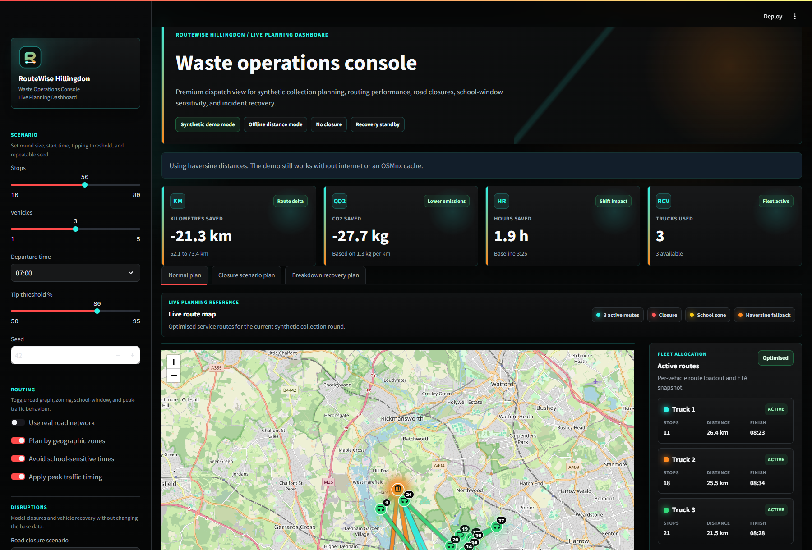
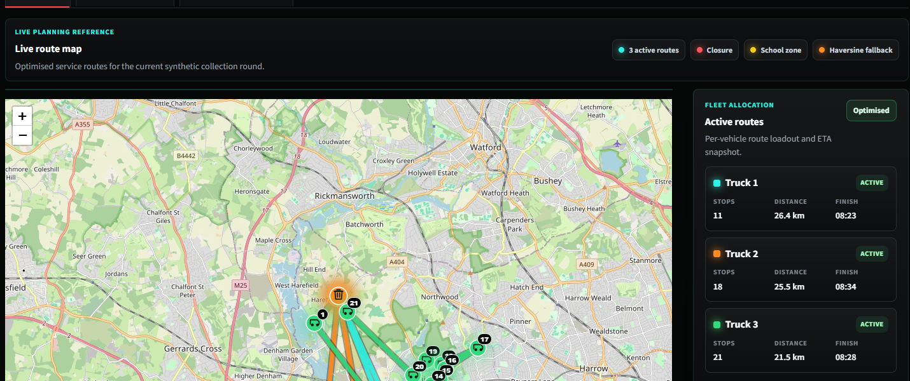
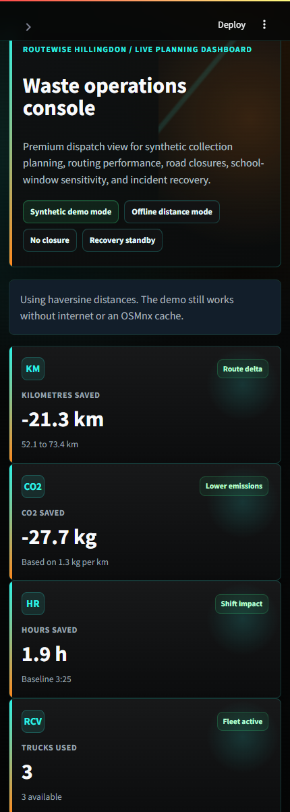
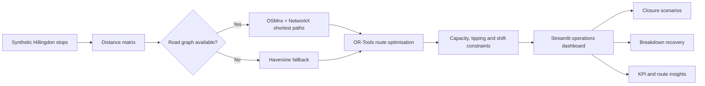

# RouteWise Hillingdon

**A premium waste-route optimisation and disruption-planning dashboard for council operations.**

Built by **Team ETB** for the **Hillingdon Hackathon route-planning challenge**.


RouteWise Hillingdon turns a manual, rigid waste-collection planning process into a data-driven operations console. It generates privacy-safe synthetic collection rounds, optimises multi-vehicle routes, renders map-based route plans, and helps dispatchers reason about disruptions such as road closures, school-window congestion, peak traffic, and truck breakdown recovery.

> **Designed as a hackathon prototype, presented like a real product:** fast to demo, safe with synthetic data, and built from open-source geospatial and optimisation tools.

---

## Visual Showcase

### Live route-planning dashboard



### Road-following route reference map and active fleet cards



### Responsive dashboard view



No pre-existing videos or screen recordings were found in the repository, so these README visuals were captured from the running Streamlit app.

---

## The Problem

Council route planning can still depend heavily on manual planning methods such as pen-and-paper route lists and static local knowledge. That process is workable for simple days, but becomes fragile when the real world changes.

Manual planning makes it harder to:

- react quickly to traffic, road closures, school congestion, or vehicle breakdowns
- compare route scenarios using consistent metrics
- understand fleet load, tipping cycles, shift timing, and route efficiency
- communicate operational decisions clearly to dispatchers and stakeholders
- estimate fuel and emissions impact from different routing choices

RouteWise Hillingdon explores how a lightweight digital planning tool could make those decisions faster, clearer, and easier to justify.

---

## How RouteWise Solves It

RouteWise Hillingdon combines synthetic data, vehicle-routing optimisation, mapping, and disruption simulation in one Streamlit dashboard.

It supports:

- synthetic Hillingdon stop generation with ward-based clustering
- multi-vehicle route optimisation with capacity and shift constraints
- tipping behaviour when vehicle load thresholds are reached
- OpenStreetMap road-network routing through OSMnx and NetworkX
- haversine fallback when road-graph data is unavailable
- school-window and peak-hour planning signals
- deterministic road-closure scenarios
- truck breakdown recovery and reassignment of unfinished stops
- KPI cards for distance, CO2 estimate, time saved, and fleet utilisation
- plain-English operational summaries for demo and judging workflows

---

## Feature Highlights

### Smart Route Planning

- Solves a multi-vehicle waste-collection VRP using OR-Tools.
- Balances route distance with vehicle capacity, tipping, and shift-time constraints.
- Supports optional geographic zoning for cleaner borough-level route allocation.

### Real Road Network Mapping

- Uses OSMnx and NetworkX to build road-distance matrices where available.
- Renders routes on a Folium map with vehicle colour coding and numbered stop markers.
- Falls back gracefully to haversine distances when offline or when road data cannot be loaded.

### Operational Disruption Handling

- Models named road-closure scenarios by removing selected road graph edges.
- Simulates truck breakdowns by splitting completed and unfinished work.
- Reassigns unfinished stops to remaining active trucks and presents a recovery plan.

### Dashboard Insights

- Shows headline KPIs for kilometres, CO2 estimate, saved hours, and trucks used.
- Includes active route cards, route distances, stop counts, finish times, and scenario state chips.
- Provides concise operational notes and recovery summaries for non-technical stakeholders.

### Privacy-Safe Demo Design

- Uses synthetic collection stops only.
- Does not rely on resident names, household addresses, council records, API keys, or PII.
- Keeps data generation and optimisation logic transparent in the repository.

---

## Tech Stack

| Layer | Tools |
|---|---|
| App UI | Python, Streamlit |
| Mapping | Folium, streamlit-folium, OpenStreetMap |
| Road graph | OSMnx, NetworkX |
| Optimisation | Google OR-Tools |
| Data | pandas, NumPy |
| Zoning | scikit-learn KMeans |
| Geospatial helpers | geopy |
| Testing | pytest |

---

## How It Works



Core project modules:

```text
src/hillingdon_routes/
|-- app.py              # Streamlit dashboard and UI rendering
|-- config.py           # Constants, colours, timings, demo defaults
|-- generate_stops.py   # Synthetic stop generation
|-- graph_utils.py      # Road graph loading and distance matrices
|-- solver.py           # OR-Tools VRP and zoned VRP logic
|-- disruptions.py      # Road closures and truck breakdown recovery
`-- viz.py              # Folium map rendering and markers
```

---

## Run the Demo

### 1. Create an environment

```powershell
python -m venv .venv
.\.venv\Scripts\Activate.ps1
python -m pip install -r requirements.txt
```

### 2. Start the dashboard

```powershell
streamlit run app.py
```

Then open:

```text
http://localhost:8501
```

### 3. Suggested judging flow

1. Click **Load stage demo preset**.
2. Click **Optimise routes**.
3. Review distance, CO2, time, and truck utilisation KPIs.
4. Show the active route map and per-truck route cards.
5. Enable road-network mode if network access and OSMnx cache are available.
6. Select a road-closure scenario and optimise again.
7. Enable breakdown simulation, choose a truck and breakdown point, then run recovery.

---

## Why It Matters

RouteWise Hillingdon is designed around practical council operations:

- **More reliable resident services:** fewer late or missed collections when routes can adapt.
- **Faster disruption response:** dispatchers can reason about closures and breakdowns immediately.
- **Operational efficiency:** route distance, finish times, fleet use, and tipping cycles are visible.
- **Emissions awareness:** route distance is translated into a clear CO2 estimate.
- **Scalable planning:** the architecture separates generation, graph loading, solving, disruption handling, and UI.

The prototype does not claim to be an operational council deployment. It demonstrates a feasible, privacy-safe planning workflow that could be extended with real aggregated operational data.

---

## Future Roadmap

Potential next steps:

- real aggregated operational collection data
- HGV restrictions, low bridges, weight limits, and narrow-road constraints
- disposal-site opening hours and queue-time modelling
- real or historical traffic feeds
- live recovery from current truck GPS positions
- exportable route sheets for drivers
- PDF scenario and impact reports
- side-by-side scenario comparison mode
- richer emissions modelling by vehicle type and load
- Docker packaging and deployment hardening
- expanded CI checks and integration tests

---

## Repository Structure

```text
.
|-- app.py                         # Streamlit entry point
|-- src/hillingdon_routes/          # Application package
|-- data/mock/                      # Synthetic JSON examples
|-- docs/disruption_handling.md     # Disruption design notes
|-- docs/images/readme/             # README screenshots captured from the app
|-- scripts/                        # Data and research context generators
|-- tests/                          # Lightweight regression tests
|-- pyproject.toml                  # Package metadata
`-- requirements.txt                # Runtime dependency pins
```

Generated OpenStreetMap caches are written to `cache/` and ignored by git.

---

## Team

Built by **Team ETB** for the **Hillingdon Hackathon route-planning challenge**.

---

## License

No license file is currently included in this repository. Add a project license before using or distributing this code beyond the hackathon/demo context.
